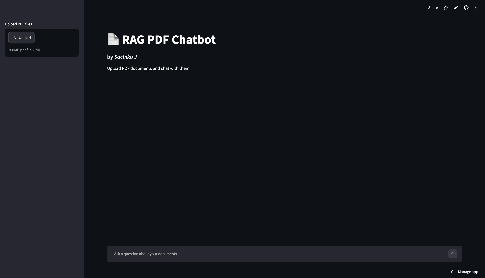
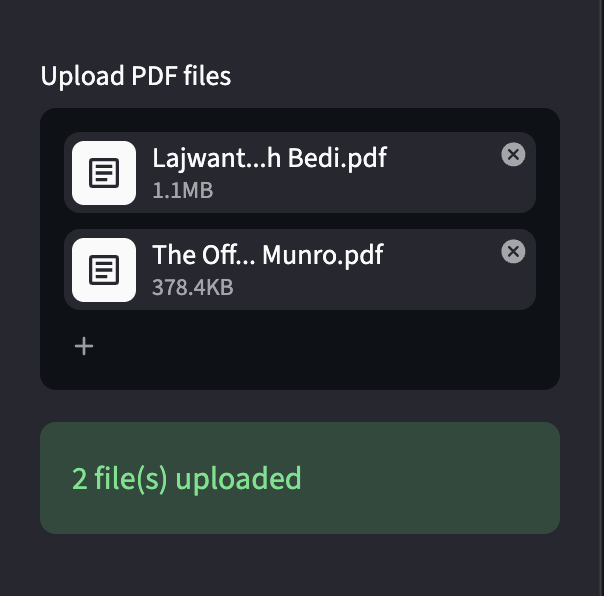
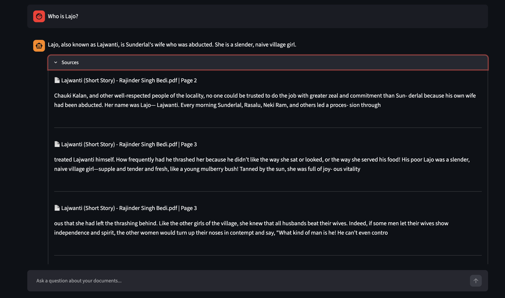

# 📄 RAG PDF Chatbot by Sachika J




A Retrieval-Augmented Generation (RAG) chatbot that allows users to upload PDF documents and ask questions about their contents. The application retrieves relevant information from uploaded documents using vector embeddings and generates context-aware answers with source attribution.


## 🚀 Live Demo

🔗 https://rag-pdf-chatbot-by-sachika.streamlit.app/

## ✨ Features

* Upload and chat with multiple PDF documents
* Semantic search using vector embeddings
* Retrieval-Augmented Generation (RAG)
* Source-grounded answers with page references
* Interactive chat interface
* Automatic vector database refresh on new uploads
* Cloud deployment using Streamlit

## 🛠️ Tech Stack

### AI / LLM

* LangChain
* Groq LLM
* HuggingFace Embeddings
* Sentence Transformers

### Vector Database

* ChromaDB

### Frontend

* Streamlit

### Backend

* Python

## 📂 Project Workflow

1. Upload PDF documents
2. Extract text from PDFs
3. Split documents into chunks
4. Generate embeddings for each chunk
5. Store embeddings in ChromaDB
6. Retrieve relevant chunks based on user queries
7. Generate answers using an LLM
8. Display answers with sources

## 🏗️ Project Structure

```text
RAG PDF Chatbot/
│
├── app.py
├── requirements.txt
├── src/
│   ├── ingest.py
│   ├── vectorstore.py
│   └── rag.py
│
└── README.md
```

## ⚙️ Installation

Clone the repository:

```bash
git clone <your-repository-url>
cd <repository-name>
```

Create a virtual environment:

```bash
python -m venv .venv
```

Activate the environment:

### macOS / Linux

```bash
source .venv/bin/activate
```

### Windows

```bash
.venv\Scripts\activate
```

Install dependencies:

```bash
pip install -r requirements.txt
```

Create a `.env` file:

```env
GROQ_API_KEY=your_api_key_here
```

Run the application:

```bash
streamlit run app.py
```

## Demo

### Multi-PDF Support



### Source Attribution



## 🎯 Key Learnings

* Retrieval-Augmented Generation (RAG)
* Document chunking strategies
* Vector embeddings
* Semantic search
* Vector databases (ChromaDB)
* LLM integration using APIs
* Streamlit deployment
* Git and GitHub workflows

## 👤 Author

**Sachika J**

Built as a learning project to explore modern AI application development using Retrieval-Augmented Generation (RAG).
